```mermaid
flowchart LR
    %% 노드 스타ì¼
    classDef input fill:#fff3e0,stroke:#e65100;
    classDef process fill:#f3e5f5,stroke:#7b1fa2;
    classDef output fill:#e8f5e9,stroke:#2e7d32;

    Input[PDF / Office]:::input
    
    subgraph SP [Standard Pipeline]
        direction LR
        C(Connector) --> D(Document Layout Parse)
        D --> R(Refinery)
        R --> CH(Chunking)
        CH --> W(Wrapper)
        W --> A(Assembler)
    end
    
    KG[("Knowledge Graph")]:::output

    Input --> C
    A --> L(Loader)
    L --> KG

    %% ê°•ì¡°
    style D stroke-width:3px,stroke:#d32f2f
```

```mermaid
flowchart LR
    %% 노드 스타ì¼
    classDef input fill:#fff3e0,stroke:#e65100;
    classDef process fill:#e1f5fe,stroke:#0277bd;
    classDef output fill:#e8f5e9,stroke:#2e7d32;

    Input[YouTube / Code]:::input
    
    subgraph NP [Normal Pipeline]
        direction LR
        C(Connector) --> R(Refinery)
        R --> CH(Chunking)
        CH --> W(Wrapper)
        W --> A(Assembler)
    end
    
    KG[("Knowledge Graph")]:::output

    Input --> C
    A --> L(Loader)
    L --> KG
    
    %% ê°•ì¡°
    style CH stroke-width:3px,stroke:#0288d1
```

<div align='center'>


# Sayou Fabric

[](https://pypi.org/project/sayou-connector/)
[](https://sayouzone.github.io/sayou-fabric/)
[](https://www.python.org/downloads/)
[](https://www.apache.org/licenses/LICENSE-2.0)
[](https://pepy.tech/project/sayou-connector)
<!-- [](https://github.com/sayouzone/sayou-fabric/stargazers) -->

_엔터프라이즈 RAG 파이프라인 구축을 위한 데이터 중심(Data-Centric) 프레임워크_

</div>

[English (README.md)](./README.md)

---

## 1. Philosophy

**Sayou Fabric은 데이터의 구조적 확실성을 추구합니다.**

우리는 비정형 데이터를 구조화된 자산으로 변환하기 위해 데이터 고유의 위상(Topology)—구문 트리(AST), 파일 계층, 메타데이터—을 분석하는 데 집중합니다. 이러한 접근 방식은 데이터의 본래 구조를 엄격히 따르며, 정밀하고 재현 가능한 지식 그래프 구축을 보장합니다.

### 1.1. Structure-First Architecture
콘텐츠를 처리하기 전에 데이터의 고유 구조를 우선적으로 분석하여 견고한 뼈대(Skeleton)를 구축합니다.
* **Code**: AST를 파싱하여 클래스, 메서드, Import 의존성을 확정적으로 연결합니다.
* **Media**: 타임라인(Timeline)과 의미론적 구간(Semantic Segment)을 기반으로 구조화합니다.
* **Docs**: 헤더, 테이블, 레이아웃 좌표를 기반으로 계층 구조를 보존합니다.

### 1.2. The 3-Tier Design Pattern
견고한 엔터프라이즈 아키텍처를 지향하며, 모든 컴포넌트는 확장성과 안정성을 위해 엄격한 계층 구조를 따릅니다.
* **Tier 1 (Interface)**: 동작을 정의하는 불변의 계약(Contract).
* **Tier 2 (Template)**: ETL 파이프라인을 위한 표준화된 로직 (Battery-included).
* **Tier 3 (Plugin)**: 벤더별 구체적인 구현체 (예: YouTube, GitHub, Notion).



---

## 2. The Ecosystem

Sayou Fabric은 독립적이면서도 유기적으로 결합된 라이브러리들로 구성됩니다.

| 패키지 | 버전 | 설명 |
| :--- | :--- | :--- |
| `sayou-core` | [](https://pypi.org/project/sayou-core/) | **스키마**, **온톨로지**, **레지스트리** 등 핵심 기반을 정의하는 커널. |
| `sayou-brain` | [](https://pypi.org/project/sayou-brain/) | 전체 데이터 처리 파이프라인의 수명 주기를 관장하는 **컨트롤 타워**. |
| `sayou-connector` | [](https://pypi.org/project/sayou-connector/) | 소스 자동 감지 및 스트리밍을 지원하는 **범용 데이터 수집기**. |
| `sayou-document` | [](https://pypi.org/project/sayou-document/) | 레이아웃, 스타일, 좌표를 보존하며 문서를 정밀하게 파싱. |
| `sayou-refinery` | [](https://pypi.org/project/sayou-refinery/) | 데이터 포맷을 정규화하고 노이즈나 개인정보(PII)를 제거. |
| `sayou-chunking` | [](https://pypi.org/project/sayou-chunking/) | 문맥(코드, 마크다운, 시간 등)에 기반하여 텍스트를 지능적으로 분할. |
| `sayou-wrapper` | [](https://pypi.org/project/sayou-wrapper/) | 데이터를 Sayou Ontology에 매핑하고 **표준화된 노드(Node)** 를 생성. |
| `sayou-assembler` | [](https://pypi.org/project/sayou-assembler/) | 노드 간의 의미론적 관계(**Edge**)를 구축하고 연결. |
| `sayou-loader` | [](https://pypi.org/project/sayou-loader/) | 구축된 지식 그래프를 데이터베이스(Graph/Vector)나 파일로 저장. |
| `sayou-extractor` | [](https://pypi.org/project/sayou-extractor/) | 하이브리드 검색(Vector + Graph)을 통해 문맥을 조회. |
| `sayou-llm` | [](https://pypi.org/project/sayou-llm/) | 다양한 LLM 제공자를 위한 통합 어댑터 인터페이스. |
| `sayou-visualizer` | [](https://pypi.org/project/sayou-visualizer/) | 파이프라인 흐름을 시각화하고 3D 지식 그래프를 렌더링. |

---

## 3. Installation

오케스트레이터 패키지를 통해 전체 제품군을 한 번에 설치할 수 있습니다:

```bash
pip install sayou-brain
```

또는 필요한 컴포넌트만 개별적으로 설치하여 가볍게 구성할 수 있습니다:

```bash
pip install sayou-chunking sayou-document
```
```bash
pip install sayou-visualizer
```

---

## 4. Quick Start

`sayou-brain` 패키지는 하위 모듈의 복잡성을 추상화한 고수준 인터페이스(Facade)를 제공합니다. 데이터 소스에 맞는 파이프라인을 선택하세요.

### Case A: Document Processing (PDF, Office)

레이아웃 보존이 필요한 문서 분석에는 `StandardPipeline`을 사용합니다.



```python
from sayou.brain import StandardPipeline

result = StandardPipeline().process(
    source="./reports/financial_q1.pdf",
    destination="knowledge_graph.json",
)

print(f"Ingestion Complete. Processed: {result['processed']}")
```

### Case B: Multimedia & Code Analysis

비디오, 코드 저장소, 웹 소스 등 로직 기반 추출이 필요한 경우 `NormalPipeline`을 사용합니다.



```python
from sayou.brain import NormalPipeline

result = NormalPipeline().process(
    source="youtube://YOUTUBE_VIDEO_ID",
    destination="./output/graph_data.json"
)

print(f"Graph Construction Complete. Nodes: {len(result['nodes'])}")
```

### Output Format (JSON)

출력 결과는 `Sayou Ontology`를 엄격히 따르는 구조화된 JSON이며, 그래프 데이터베이스나 벡터 저장소에 즉시 적재 가능합니다.

<details> <summary><b>JSON 결과 예시</b></summary>

```json
{
  "nodes": [
    {
      "node_id": "sayou:doc:1_h_0",
      "node_class": "sayou:Topic",
      "attributes": { "schema:text": "Financial Summary Q1" },
      "relationships": {}
    },
    { "……" }
  ],
  "edges": [
    { "……" }
  ]
}
```

</details>

---

## 5. Visualizer Showcase

데이터 엔지니어링에서 **관측 가능성(Observability)** 은 필수적입니다. Sayou Fabric은 데이터 위상과 파이프라인 흐름을 검사할 수 있는 내장 렌더링 도구를 제공합니다.

### 📊 Pipeline Telemetry (DAG Tracer)
실시간으로 실행 흐름을 모니터링합니다. 어떤 플러그인이 활성화되었는지 시각화하고, 데이터가 파이프라인을 거치며 어떻게 변환되는지 검증할 수 있습니다.


### 🌌 Holographic Knowledge Graph
원시 데이터를 인터랙티브한 지식 그래프로 시각화합니다.

* **Analytics Knowledge View**: 디버깅을 위해 노드의 엄격한 속성과 관계를 검사합니다.


* **Showcase Knowledge View**: 지식 베이스의 클러스터와 의미적 밀도를 시각화합니다.


---

## 6. Documentation & Contribution

Sayou Fabric은 현재 **Public Beta(v0.4.0)** 단계입니다. 우리는 코어 엔진을 안정화하고 더 많은 엔터프라이즈 데이터 소스를 지원하기 위해 어댑터 생태계를 확장하고 있습니다.

* **[Official Documentation](https://sayouzone.github.io/sayou-fabric/)**
* **[Contributing Guide](CONTRIBUTING.md)**

---

## 7. License

Apache 2.0 License © 2026 **Sayouzone**