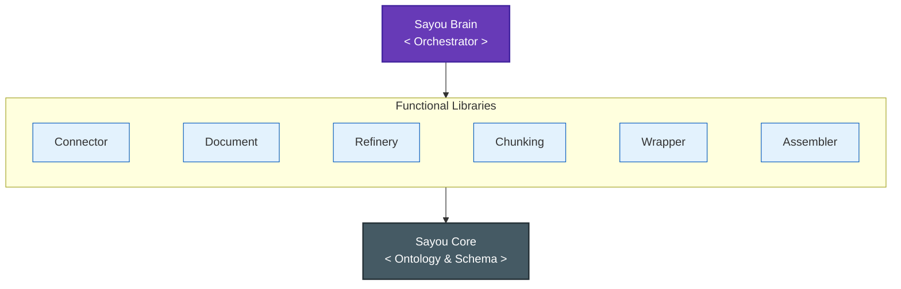
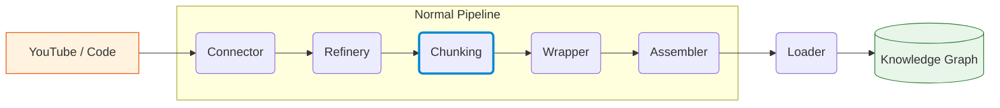

<div align='center'>


# Sayou Fabric

[](https://pypi.org/project/sayou-connector/)
[](https://sayouzone.github.io/sayou-fabric/)
[](https://www.python.org/downloads/)
[](https://www.apache.org/licenses/LICENSE-2.0)
[](https://pepy.tech/project/sayou-connector)
<!-- [](https://github.com/sayouzone/sayou-fabric/stargazers) -->

_The Data-Centric Framework for Building Enterprise RAG Pipelines_
<br>
_**Observe, Structure, and Assemble your Knowledge Graph.**_

</div>

[한국어 (README.ko.md)](./README.ko.md)

---

## 1. Philosophy

**Sayou Fabric is a framework for Deterministic Knowledge Graph Construction.**

We focus on transforming unstructured data into structured assets by analyzing their intrinsic topology—syntax trees, file hierarchies, and metadata. This approach ensures that the constructed Knowledge Graph is precise, reproducible, and structurally sound, strictly following the data's native organization.

### 1.1. Structure-First Architecture

We prioritize the native structure of data to build a solid skeleton before processing the content.
* **Code**: Parsed via AST to deterministically link Classes, Methods, and Import dependencies.
* **Media**: Structured via Temporal Timeline and Semantic Segmentation.
* **Docs**: Hierarchically organized by Headers, Tables, and Layout Coordinates.

### 1.2. The 3-Tier Design Pattern

Inspired by robust enterprise architectures, every component adheres to a strict hierarchy to ensure stability at scale:
* **Tier 1 (Interface)**: The immutable contract defining behavior.
* **Tier 2 (Template)**: Standardized logic for ETL pipelines (Battery-included).
* **Tier 3 (Plugin)**: Vendor-specific implementations (e.g., YouTube, GitHub, Notion).



---

## 2. The Ecosystem

Sayou Fabric consists of independent, loosely coupled libraries that work together seamlessly.

| Package | Version | Description |
| :--- | :--- | :--- |
| `sayou-core` | [](https://pypi.org/project/sayou-core/) | Foundational layer defining Schemas, Ontology, and base components. |
| `sayou-brain` | [](https://pypi.org/project/sayou-brain/) | Manages the entire lifecycle of data processing pipelines. |
| `sayou-connector` | [](https://pypi.org/project/sayou-connector/) | Universal ingestor with auto-source detection and streaming support. |
| `sayou-document` | [](https://pypi.org/project/sayou-document/) | Parses documents while preserving layout, styles, and spatial coordinates. |
| `sayou-refinery` | [](https://pypi.org/project/sayou-refinery/) | Normalizes data formats and removes noise or PII. |
| `sayou-chunking` | [](https://pypi.org/project/sayou-chunking/) | Splits text intelligently based on context (Code, Markdown, Time). |
| `sayou-wrapper` | [](https://pypi.org/project/sayou-wrapper/) | Maps raw data to the Sayou Ontology and creates standardized Nodes. |
| `sayou-assembler` | [](https://pypi.org/project/sayou-assembler/) | Constructs semantic relationships (Edges) between Nodes. |
| `sayou-loader` | [](https://pypi.org/project/sayou-loader/) | Exports the constructed Knowledge Graph to Databases or Files. |
| `sayou-extractor` | [](https://pypi.org/project/sayou-extractor/) | Retrieves context using Hybrid Search (Vector + Graph). |
| `sayou-llm` | [](https://pypi.org/project/sayou-llm/) | A unified adapter interface for various LLM providers. |
| `sayou-visualizer` | [](https://pypi.org/project/sayou-visualizer/) | Visualizes the pipeline flow and renders 3D Knowledge Graphs. |

---

## 3. Installation

You can install the entire suite via the orchestrator package:

```bash
pip install sayou-brain
```

Or install individual components as needed for a lightweight setup:

```bash
pip install sayou-chunking sayou-document
```
```bash
pip install sayou-visualizer
```

---

## 4. Quick Start

The `sayou-brain` package provides high-level facades that abstract away the complexity of underlying modules. Choose the pipeline that fits your data source.

### Case A: Document Processing (PDF, Office)

Use `StandardPipeline` for layout-preserving document analysis.


```python
from sayou.brain import StandardPipeline

result = StandardPipeline().process(
    source="./reports/financial_q1.pdf",
    destination="knowledge_graph.json",
)

print(f"Ingestion Complete. Processed: {result['processed']}")
```

### Case B: Multimedia & Code Analysis

Use `NormalPipeline` for logic-based extraction from Video, Code repositories, or Web sources.



```python
from sayou.brain import NormalPipeline

result = NormalPipeline().process(
    source="youtube://YOUTUBE_VIDEO_ID",
    destination="./output/graph_data.json"
)

print(f"Graph Construction Complete. Nodes: {len(result['nodes'])}")
```

### Output Format (JSON)

The output is a structured JSON strictly following the `Sayou Ontology`, ready for Graph Databases or Vector Stores.

<details> <summary><b>Click to expand JSON example</b></summary>

```json
{
  "nodes": [
    {
      "node_id": "sayou:doc:1_h_0",
      "node_class": "sayou:Topic",
      "attributes": { "schema:text": "Financial Summary Q1" },
      "relationships": {}
    },
    { "……" }
  ],
  "edges": [
    { "……" }
  ]
}
```

</details>

---

## 5. Visualizer Showcase

Observability is crucial for data engineering. Sayou Fabric provides built-in rendering tools to inspect your data topology and pipeline flow.

### 📊 Pipeline Telemetry (DAG Tracer)
Monitor the execution flow. Visualize which plugins are activated and verify how data transforms across the pipeline.


### 🌌 Holographic Knowledge Graph
Transform raw data into an interactive KG city.

* **Analytics Knowledge View**: Inspect strict node properties and relationships for debugging.


* **Showcase Knowledge View**: Visualize the cluster and semantic density of your knowledge base.


---

## 6. Documentation & Contribution

Sayou Fabric is currently in **Public Beta (v0.4.0)**. We are actively stabilizing the core engine and expanding the adapter ecosystem to support more enterprise data sources.

* **[Official Documentation](https://sayouzone.github.io/sayou-fabric/)**
* **[Contributing Guide](CONTRIBUTING.md)**

---

## 7. License

Apache 2.0 License © 2026 **Sayouzone**