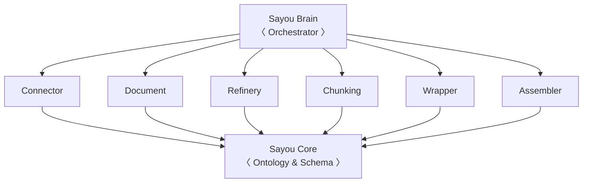

# Architecture

## System Overview



| Layer | Package | Role |
| :--- | :--- | :--- |
| **Core** | `sayou-core` | Schemas, ontology constants, base component model, plugin registry |
| **Data Libraries** | `sayou-connector` … `sayou-loader` | Each owns a single pipeline stage. Communicate via Core schemas. |
| **Orchestrator** | `sayou-brain` | Wires libraries together. Exposes `StandardPipeline` and `NormalPipeline`. |

---

## The 3-Tier Pattern

Every library follows the same internal structure.

=== "Tier 1 — Interface"
    Defines the immutable contract. Abstract base classes that specify method signatures, input/output types, and lifecycle hooks.

    ```python
    class BaseSplitter(BaseComponent):
        @abstractmethod
        def _do_split(self, doc: SayouBlock) -> List[SayouChunk]:
            raise NotImplementedError
    ```

    This tier never changes after release. Code depending on `BaseSplitter` will never break.

=== "Tier 2 — Template"
    Official, production-tested implementations that cover the common cases.

    ```python
    class CodeSplitter(BaseSplitter):
        """Routes to the correct language-specific splitter."""
        def _do_split(self, doc: SayouBlock) -> List[SayouChunk]:
            splitter = self._resolve_splitter(doc)
            return splitter.split(doc, self.chunk_size)
    ```

=== "Tier 3 — Plugin"
    Vendor-specific or domain-specific extensions. Registered at import time — no changes to existing code required.

    ```python
    @register_component("splitter")
    class RustSplitter(BaseSplitter):
        language = "rust"
        extensions = [".rs"]

        def _do_split(self, doc: SayouBlock) -> List[SayouChunk]:
            ...
    ```

---

## Data Flow

Each stage exchanges data using Core schemas. No raw dicts pass between modules.

```
SayouPacket    ← Connector output  (raw bytes + URI + metadata)
      ↓
SayouBlock     ← Refinery / Document output  (clean text + structure)
      ↓
SayouChunk     ← Chunking output  (content slice + structural metadata)
      ↓
SayouNode      ← Wrapper output  (typed graph entity + ontology class)
      ↓
SayouOutput    ← Assembler output  (nodes + typed edges)
      ↓
Knowledge Graph  ← Loader output  (JSON / VectorDB / Graph DB)
```

---

## Plugin Registry

Components register themselves at import time via `@register_component`. The Brain selects the correct implementation by calling `can_handle()` on each registered plugin, which returns a confidence score `[0.0–1.0]`. The highest scorer is used.

```python
@register_component("fetcher")
class GitHubFetcher(BaseFetcher):
    @classmethod
    def can_handle(cls, source: str, strategy: str = "auto") -> float:
        if strategy == "github":
            return 1.0
        if source.startswith("https://github.com"):
            return 0.9
        return 0.0
```

Adding a new capability only requires registering a new plugin — existing code is never modified.

---

## Ontology

`sayou-core` defines the shared vocabulary used across all libraries.

=== "Node Classes"
    | Class | URI | Description |
    | :--- | :--- | :--- |
    | File | `sayou:File` | Source file |
    | Class | `sayou:Class` | Class definition |
    | Function | `sayou:Function` | Module-level function |
    | Method | `sayou:Method` | Class method |
    | Topic | `sayou:Topic` | Document section / heading |
    | VideoSegment | `sayou:VideoSegment` | Timestamped media segment |

=== "Edge Types"
    | Predicate | URI | Confidence |
    | :--- | :--- | :--- |
    | Contains | `sayou:contains` | HIGH |
    | Imports | `sayou:imports` | HIGH |
    | Calls | `sayou:calls` | HIGH |
    | Maybe Calls | `sayou:maybeCalls` | LOW |
    | Inherits | `sayou:inherits` | HIGH |
    | Overrides | `sayou:overrides` | HIGH |
    | Uses Type | `sayou:usesType` | MEDIUM |