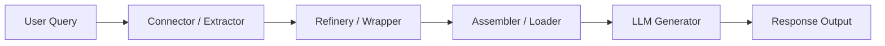

# Sayou RAG — Retrieval-Augmented Generation Engine

> **Sayou RAG** is the orchestration layer of the **Sayou Data Fabric**,  
> enabling intelligent data-driven reasoning, generation, and retrieval at scale.

---

## Introduction

Sayou RAG connects the Sayou ecosystem — **data, schema, and LLMs** — into a unified reasoning fabric.  
It’s a modular and composable framework for building Retrieval-Augmented Generation pipelines that can:

- Fetch structured or unstructured data from multiple sources  
- Clean and normalize data into schema-aligned formats  
- Build contextual knowledge graphs for deep retrieval  
- Generate answers or insights with local or cloud LLMs  

Whether you’re handling CSVs, APIs, PDFs, or knowledge bases —  
Sayou RAG helps you **bridge raw data to intelligent reasoning.**

---

## Architecture Overview



- Connector: Collects data from APIs or local files
- Refinery: Cleans, filters, or enriches raw content
- Wrapper: Converts structured data into schema-aligned formats
- Assembler: Links entities into a knowledge graph
- LLM: Generates contextual answers using any compatible model

## ⚡ Getting Started

```python
pip install sayou-rag
```

① Basic RAG

For most users — minimal setup, instant results.

```python
from sayou.rag.pipeline.basic_pipeline import BasicRAG

pipeline = BasicRAG()
pipeline.initialize_all(model_path="models/gemma-3-1b-it")
result = pipeline.run(query="Summarize today's subway routes.")

print(result["answer"])
```

② Advanced RAG

For experts — fully composable, multi-source pipelines.

```python
from sayou.rag.pipeline.advanced_pipeline import AdvancedRAG

pipeline = AdvancedRAG()
pipeline.initialize_all(config_path="configs/rag_config.yaml")
result = pipeline.run(query="Summarize company internal policies.", contains_documents=True)
```

## Pipeline Composition

| Stage       | Library           | Role                         |
| ----------- | ----------------- | ---------------------------- |
| `connector` | `sayou-connector` | Fetch API, DB, or file data  |
| `refinery`  | `sayou-refinery`  | Text cleaning, normalization |
| `wrapper`   | `sayou-wrapper`   | Schema alignment             |
| `assembler` | `sayou-assembler` | Knowledge Graph construction |
| `extractor` | `sayou-extractor` | Retrieval & indexing         |
| `llm`       | `sayou-llm`       | Text generation & reasoning  |

## Design Philosophy

"Knowledge is not retrieved — it is orchestrated."

Sayou RAG focuses on flow consistency rather than fixed templates.
It provides:

- Predictable default flows (Basic Mode)
- Fully modular extension (Advanced Mode)
- Pluggable LLM & Data Sources
- Observability via built-in tracing