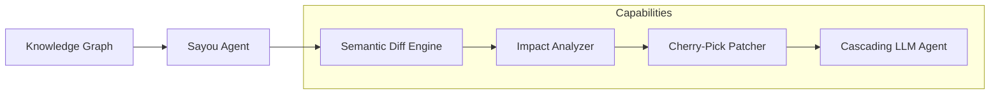

# Sayou Agent Overview

Coming Soon

Sayou Agent is an AI-powered layer that consumes the Knowledge Graph produced by Sayou Fabric and performs intelligent, cascading analysis — answering questions like:

> *"If I change this function, what else breaks?"*

---

## Core Capabilities

=== "Impact Analysis"
    Traverses the KG along CALLS, INHERITS, and OVERRIDES edges to compute the **blast radius** of a change.

    - Given a modified function, finds all callers, transitive dependencies, and override chains.
    - Produces a ranked list of affected symbols with confidence scores.

=== "Semantic Diff"
    Compares two versions of a codebase using AST hash comparison — ignoring whitespace and comments.

    - Detects added, removed, and modified functions at the symbol level.
    - Cherry-pick individual function changes and apply them selectively.

=== "Cascading Patch"
    Uses an LLM to analyze the impact report and suggest (or apply) fixes to affected downstream code.

    - Identifies symbols that reference a changed API.
    - Proposes minimal patches with rollback support.

---

## Architecture

```mermaid
graph LR
    KG[Knowledge Graph] --> Agent[Sayou Agent]

    subgraph Capabilities
        Diff[Semantic Diff Engine]
        Impact[Impact Analyzer]
        Patch[Cherry-Pick Patcher]
        Cascade[Cascading LLM Agent]
    end

    Agent --> Diff --> Impact --> Patch --> Cascade
```

---

!!! info "Under active development"
    Sayou Agent is being built on top of the Sayou Fabric KG infrastructure. The KG edge types (CALLS, INHERITS, OVERRIDES) introduced in the Assembler are specifically designed to support this layer. Full documentation will be published at release.