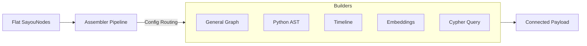

# sayou-assembler

[](https://pypi.org/project/sayou-assembler/)
[](https://www.apache.org/licenses/LICENSE-2.0)
[](https://sayouzone.github.io/sayou-fabric/library-guides/assembler/)

**The Knowledge Builder for Sayou Fabric.**

`sayou-assembler` acts as the structural engineer of the pipeline. It accepts flat lists of `SayouNode` objects produced by the Wrapper and constructs meaningful relationships (Edges), embeddings, or specific query payloads.

While the Wrapper focuses on *what* the data is (Schema), the Assembler focuses on *how* the data connects (Topology).

---

## 1. Architecture & Role

The Assembler takes standardized Nodes and applies a **Building Strategy** to generate a connected graph structure or vector payloads ready for loading.



### 1.1. Core Features
* **Topology Construction**: Automatically links nodes (e.g., Parent-Child, Function-Class) based on metadata.
* **Domain Specificity**: Dedicated builders for Python code analysis and Video timelines.
* **Bi-directional Linking**: Automatically generates reverse edges (e.g., `contains` <-> `belongsTo`) to ensure graph traversability.

---

## 2. Available Strategies

`sayou-assembler` provides specialized builders for different data domains.

| Strategy Key | Builder Class | Description |
| :--- | :--- | :--- |
| **`graph`** | `GraphBuilder` | **[Default]** Generic builder. Links nodes based on `parent_id` and generic relationships. |
| **`code`** | `CodeGraphBuilder` | **[Code]** Parses Python AST metadata to link Imports, Classes, and Methods. |
| **`timeline`** | `TimelineBuilder` | **[Media]** Sequences video segments or logs chronologically (`NEXT`, `PREV`). |
| **`vector`** | `VectorBuilder` | **[Search]** Converts node content into vector embeddings. |
| **`cypher`** | `CypherBuilder` | **[DB]** Generates Neo4j `MERGE` statements for idempotent inserts. |

---

## 3. Installation

```bash
pip install sayou-assembler
```

---

## 4. Usage

The `AssemblerPipeline` is the entry point. It transforms `SayouOutput` (from Wrapper) into a dictionary containing `nodes` and `edges`.

### Case A: General Graph Construction

The default strategy for general documents (PDF, Markdown).

```python
from sayou.assembler import AssemblerPipeline

wrapper_output = {
    "nodes": [
        {"node_id": "doc:1", "node_class": "sayou:Document", "attributes": {...}},
        {"node_id": "doc:1:header", "attributes": {"meta:parent_id": "doc:1"}, ...}
    ]
}

graph_data = AssemblerPipeline.process(data=wrapper_output)

print(f"Nodes: {len(graph_data['nodes'])}, Edges: {len(graph_data['edges'])}")
```

### Case B: Python Code Graph

Links functions to classes and resolves import dependencies.

```python
from sayou.assembler import AssemblerPipeline

wrapper_output = {
    "nodes": [
        {"node_id": "doc:1", "node_class": "sayou:Document", "attributes": {...}},
        {"node_id": "doc:1:header", "attributes": {"meta:parent_id": "doc:1"}, ...}
    ]
}

code_graph = AssemblerPipeline.process(data=wrapper_output)

print(f"Dependency Edges: {len(code_graph['edges'])}")
```

### Case C: Multimedia Timeline

Sequences video segments by time.

```python
from sayou.assembler import AssemblerPipeline

wrapper_output = {
    "nodes": [
        {"node_id": "doc:1", "node_class": "sayou:Document", "attributes": {...}},
        {"node_id": "doc:1:header", "attributes": {"meta:parent_id": "doc:1"}, ...}
    ]
}

timeline_graph = AssemblerPipeline.process(data=wrapper_output)
print(f"Timeline Sequence Created.")
```

---

## 5. Configuration Keys

You can customize the building process via the `config` dictionary.

* **`graph`**: `create_reverse_edges` (bool), `default_edge_label`.
* **`python`**: `resolve_imports` (bool), `include_external_libs` (bool).
* **`timeline`**: `interval_threshold` (float).
* **`vector`**: `embedding_model` (e.g., openai, huggingface), `batch_size`.
* **`cypher`**: `merge_mode` (bool), `batch_size`.

---

## 6. License

Apache 2.0 License © 2026 **Sayouzone**