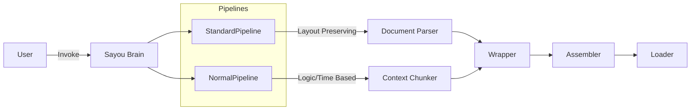

# sayou-brain

[](https://pypi.org/project/sayou-brain/)
[](https://www.apache.org/licenses/LICENSE-2.0)
[](https://sayouzone.github.io/sayou-fabric/sayou-agent/overview/)

**The Central Nervous System (Orchestrator) of Sayou Fabric.**

`sayou-brain` acts as the **Control Tower** for the entire Sayou ecosystem. It provides high-level **Pipeline Facades** that abstract away the complexity of connecting individual modules (`connector`, `document`, `chunking`, etc.).

Instead of manually wiring components, you simply invoke a Pipeline, and the Brain handles **routing, configuration propagation, and error handling**.

---

## 1. Architecture & Role

The Brain sits between the User and the low-level modules. It directs data flow based on the chosen Pipeline strategy.



### 1.1. Core Features
* **Facade Pattern**: Users only interact with `Pipeline.process()`. No need to import sub-modules directly.
* **Config Propagation**: A single config dictionary is distributed to all sub-modules.
* **Smart Routing**: Automatically selects the optimal `Connector` based on the input source string.

---

## 2. Available Pipelines

Sayou Brain provides two distinct pipelines optimized for different data types.

| Pipeline | Best For | Description |
| :--- | :--- | :--- |
| **`StandardPipeline`** | PDF, Office, HWP | Uses `sayou-document` to preserve **spatial layout, headers, and tables**. Maintains visual hierarchy. |
| **`NormalPipeline`** | Code, Video, Web | Bypasses layout parsing. Focuses on **semantic logic** (AST for code, Timeline for video). |

---

## 3. Installation

Installing `sayou-brain` automatically installs all core dependencies and sub-modules.

```bash
pip install sayou-brain
```

---

## 4. Usage

### Case A: StandardPipeline (Document-Centric)

Use this for documents where visual layout matters (e.g., Financial Reports, Papers).

```python
from sayou.brain import StandardPipeline

result = StandardPipeline.process(
    source="./reports/financial_q1.pdf",
    destination="./examples/output/financial_graph.json"
)

print(f"Processed Nodes: {len(result['nodes'])}")
```

### Case B: NormalPipeline (Logic-Centric)

Use this for structured data, code, or multimedia streams.

```python
from sayou.brain import NormalPipeline

result = NormalPipeline.process(
    source="github://sayouzone/sayou-fabric",
    destination="./examples/output/code_graph.json",
    token="GITHUB_TOKEN",
    path="packages/sayou-connector/src/sayou/connector",
)

nodes = result.get("nodes", [])
edges = result.get("edges", [])

print(f"Total Nodes: {len(nodes)}")
print(f"Total Edges: {len(edges)}")
```

---

## 5. Configuration Keys

The following keys can be used in the `config` dictionary passed to the Pipeline:

* **`connector`**: User-Agent, Timeout settings, Proxy config.
* **`refinery`**: PII masking rules, Unicode normalization, Regex filters.
* **`chunking`**: Strategy selection (Token/Line/Semantic), Size limits, Overlap.
* **`loader`**: Database credentials, Output paths, File modes.

---

## 6. License

Apache 2.0 License © 2026 **Sayouzone**