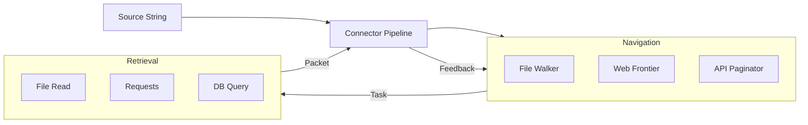

# sayou-connector

[](https://pypi.org/project/sayou-connector/)
[](https://www.apache.org/licenses/LICENSE-2.0)
[](https://sayouzone.github.io/sayou-fabric/library-guides/connector/)

**The Universal Data Ingestion Engine for Sayou Fabric.**

`sayou-connector` provides a unified interface to fetch data from diverse sources—Files, Cloud Drives, Databases, and SaaS APIs—normalizing everything into a standard format called **SayouPacket**.

It decouples the logic of **Navigation** (Generator) from **Retrieval** (Fetcher), enabling complex recursive crawling, pagination, and API traversal strategies out of the box.

---

## 1. Architecture & Role

The Connector Pipeline manages the **Feedback Loop** between discovery and retrieval. It yields a stream of `SayouPacket` objects ready for the next stage (Refinery).



### 1.1. Core Features
* **Generator/Fetcher Pattern**: Separates "Where to go next" (Generator) from "How to get it" (Fetcher).
* **Unified Packet**: Whether the source is a Notion Page or a PostgreSQL Row, the output is always a uniform `SayouPacket`.
* **Resilience**: Built-in rate limiting, retries, and error handling for unstable network sources.

---

## 2. Supported Sources

`sayou-connector` supports a vast array of plugins, continuously expanding to cover Enterprise SaaS and Databases.

| Category | Key Sources | Description |
| :--- | :--- | :--- |
| **Local / File** | `file`, `obsidian` | Local file systems, Markdown vaults. |
| **Web / Media** | `web`, `youtube`, `wikipedia`, `rss` | Web crawling (Trafilatura), YouTube transcripts, Wiki articles. |
| **SaaS / Cloud** | `github`, `notion`, `google_drive`, `gmail` | Repository code, Notion workspaces, G-Suite documents. |
| **Database** | `postgres`, `mysql`, `mongodb`, `oracle` | SQL/NoSQL databases with pagination support. |

---

## 3. Installation

```bash
pip install sayou-connector
```

---

## 4. Usage

The `ConnectorPipeline` acts as the entry point. It automatically detects the source type or accepts a specific strategy.

### Case A: Local & Web (Simple)

Fetching simple files or web pages.

```python
from sayou.connector import ConnectorPipeline

packets = ConnectorPipeline.process(
    source="./my_docs",
    strategy="file"
)

web_packets = ConnectorPipeline.process(
    source="https://news.daum.net/tech",
    strategy="web"
)

for packet in web_packets:
    print(f"[Fetched] {packet.uri} ({len(packet.data)} bytes)")
```

### Case B: SaaS Integration (GitHub / Notion)

Fetching structured data from external APIs.

```python
from sayou.connector import ConnectorPipeline

repo_packets = ConnectorPipeline.process(
    source="https://github.com/sayouzone/sayou-fabric",
    strategy="github"
)

print(f"Collected {len(list(repo_packets))} files from repo.")
```

### Case C: Database Ingestion

Fetching rows from a database table.

```python
from sayou.connector import ConnectorPipeline

db_config = {
    "host": "localhost",
    "user": "admin",
    "password": "password",
    "db": "sales_db"
}

# Fetch rows from 'orders' table
db_packets = ConnectorPipeline.process(
    source="orders", 
    strategy="postgres",
    config=db_config
)

# Each packet contains a batch of rows
for packet in db_packets:
    print(f"Batch rows: {len(packet.data)}")
```

---

## 5. Configuration Keys

The `config` dictionary is crucial for authentication and connection settings.

* **`auth`**: API Keys (e.g., `github_token`, `notion_token`, `google_creds`).
* **`db`**: Database credentials (`host`, `port`, `user`, `password`).
* **`crawl`**: Web crawling settings (`user_agent`, `depth_limit`, `domain_lock`).
* **`filter`**: File extensions to include/exclude (e.g., `include=[".py", ".md"]`).

---

## 6. License

Apache 2.0 License © 2026 **Sayouzone**