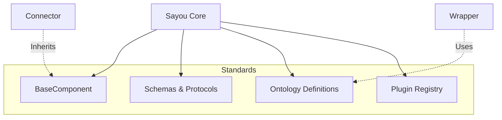

# sayou-core

[](https://pypi.org/project/sayou-core/)
[](https://www.apache.org/licenses/LICENSE-2.0)
[](https://sayouzone.github.io/sayou-fabric/library-guides/core/)

**The Fundamental Foundation for Sayou Fabric.**

`sayou-core` provides the shared DNA for all Sayou libraries. It defines the **Base Architecture**, **Standard Data Protocols**, and the **Ontology Definitions** that ensure consistency across the entire ecosystem.

While users typically interact with high-level pipelines (like `sayou-brain`), `sayou-core` acts as the invisible **Spinal Cord**, defining how modules communicate and how data is structured.

---

## 1. Architecture & Role

Core is not a processing engine itself but a **Library of Standards**. It enforces structure so that a Connector written by one developer can seamlessly talk to a Refinery written by another.



### 1.1. Core Features
* **Unified Component Model**: Every plugin inherits from `BaseComponent`, guaranteeing standardized logging (`self._log`) and lifecycle management.
* **Lingua Franca (Schemas)**: Defines `SayouPacket` and `SayouBlock` so modules exchange typed objects, not random dictionaries.
* **Ontology Hub**: Centralizes vocabulary (`sayou:Topic`, `sayou:hasChild`) to prevent semantic drift.

---

## 2. Key Components

### 2.1. Schemas (`schemas.py`)
The immutable data contracts used throughout the pipeline.
* **`SayouPacket`**: The universal container for raw data transport (Connector -> Refinery).
* **`SayouBlock`**: The atomic unit of refined content (Refinery -> Chunking).
* **`SayouNode`**: The graph entity with ID, Class, and Attributes (Wrapper -> Assembler).

### 2.2. Ontology (`ontology.py`)
Defines the semantic vocabulary for the Knowledge Graph.
* **`SayouClass`**: Enum of node types (e.g., `Document`, `Video`, `Function`).
* **`SayouRelation`**: Enum of edge types (e.g., `contains`, `calls`, `next`).

### 2.3. Base Architecture (`base_component.py`)
The root class for all Sayou objects. It handles configuration injection and provides utility decorators like `@safe_run` and `@measure_time`.

---

## 3. Installation

`sayou-core` is a dependency of all Sayou libraries and is installed automatically.

```bash
pip install sayou-core
```

---

## 4. Developer Guide (Usage)

Unlike other modules, you use `sayou-core` when **building extensions** or **custom plugins**, not for running pipelines.

### Case A: Creating a Custom Component

Inherit from `BaseComponent` to get logging, error handling, and config management for free.

```python
from sayou.core.base_component import BaseComponent
from sayou.core.decorators import measure_time, safe_run
from sayou.core.schemas import SayouPacket

class MyCustomPlugin(BaseComponent):
    component_name = "MyPlugin"

    @measure_time
    @safe_run(default_return=None)
    def process(self, data: str) -> SayouPacket:
        self._log(f"Processing data: {data}...")
        
        # Your custom logic here
        result = data.upper()
        
        return SayouPacket(data=result, success=True)
```

### Case B: Using the Ontology

Use the centralized ontology enums to ensure your graph nodes are compatible with the standard visualizer.

```python
from sayou.core.ontology import SayouClass, SayouRelation

# Correct usage
node_type = SayouClass.TOPIC      # "sayou:Topic"
edge_type = SayouRelation.CONTAINS # "sayou:contains"

print(f"Creating a node of type: {node_type.value}")
```

---

## 5. License

Apache 2.0 License © 2026 **Sayouzone**