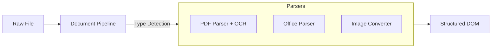

# sayou-document

[](https://pypi.org/project/sayou-document/)
[](https://www.apache.org/licenses/LICENSE-2.0)
[](https://sayouzone.github.io/sayou-fabric/library-guides/document/)

**The Universal Document Parsing Gateway for Sayou Fabric.**

`sayou-document` is a high-fidelity parsing engine that converts diverse document formats (PDF, DOCX, PPTX, XLSX, Images) into a unified, structured **Document Object Model (DOM)**.

Unlike simple text extractors, it preserves the semantic structure of documents—headers, tables, charts, and layout coordinates—making it ideal for RAG applications that require layout awareness.

---

## 1. Architecture & Role

The Document engine acts as a normalizer. It accepts raw file bytes and applies the optimal **Parser Strategy** to output a structured `SayouDocument`.



### 1.1. Core Features
* **Smart Routing**: Automatically detects file types (signatures) and selects the best parser.
* **Hybrid Extraction**: Combines native text extraction for digital PDFs with OCR fallback for scanned images.
* **Strict Schema**: Outputs a standardized hierarchy (`Document` > `Page` > `Element`) regardless of input format.

---

## 2. Supported Formats

`sayou-document` supports the following file types out-of-the-box.

| Format | Strategy Key | Description |
| :--- | :--- | :--- |
| **PDF** | `pdf` | Extracts text, images, and TOC using `PyMuPDF`. Supports OCR. |
| **Word** | `docx` | Parses DOCX files, preserving heading levels and lists. |
| **PowerPoint** | `pptx` | Extracts text frames, speaker notes, and tables from slides. |
| **Excel** | `xlsx` | Converts sheets into table elements and extracts embedded charts. |
| **Image** | `image` | Auto-converts JPG/PNG/TIFF to PDF, then applies OCR. |

---

## 3. Installation

```bash
pip install sayou-document

# For OCR support (requires Tesseract installed on OS)
pip install "sayou-document[ocr]"
```

---

## 4. Usage

The `DocumentPipeline` orchestrates file detection and parsing. It standardizes the input via the `process` method.

### Case A: PDF Parsing (Standard)

Processes a PDF file to extract structured text and layout info.

```python
import os
from sayou.document import DocumentPipeline

file_path = "quarterly_report.pdf"
with open(file_path, "rb") as f:
    file_bytes = f.read()

doc = DocumentPipeline.process(
    data=file_bytes,
    metadata={"filename": os.path.basename(file_path)}
)

# 4. Result
print(f"File: {doc.file_name}, Pages: {doc.page_count}")
print(f"First Element: {doc.pages[0].elements[0].text}")
```

### Case B: Office Documents (Word/Excel)

Parses Office formats while preserving table structures.

```python
from sayou.document import DocumentPipeline

with open("salary_table.xlsx", "rb") as f:
    file_bytes = f.read()

doc = DocumentPipeline.process(
    data=file_bytes,
    metadata={"filename": "salary_table.xlsx"}
)

# Access tables
tables = [e for p in doc.pages for e in p.elements if e.category == "table"]
print(f"Extracted {len(tables)} tables.")
```

### Case C: Image with OCR

Automatically handles image conversion and OCR processing.

```python
from sayou.document import DocumentPipeline

# Initialize with OCR enabled
pipeline = DocumentPipeline(config={"use_ocr": True, "ocr_lang": "eng"})

with open("scanned_receipt.png", "rb") as f:
    file_bytes = f.read()

doc = pipeline.process(
    data=file_bytes,
    metadata={"filename": "scanned_receipt.png"}
)

print(f"OCR Result: {doc.pages[0].elements[0].text}")
```

---

## 5. Configuration Keys

Customize the parsing behavior via the `config` dictionary.

* **`use_ocr`**: (bool) Enable OCR for scanned pages or images.
* **`ocr_lang`**: (str) Tesseract language code (default: `eng+kor`).
* **`extract_images`**: (bool) Whether to extract embedded images to disk.
* **`table_strategy`**: (str) `fast` (text-based) or `accurate` (vision-based).

---

## 6. License

Apache 2.0 License © 2026 **Sayouzone**