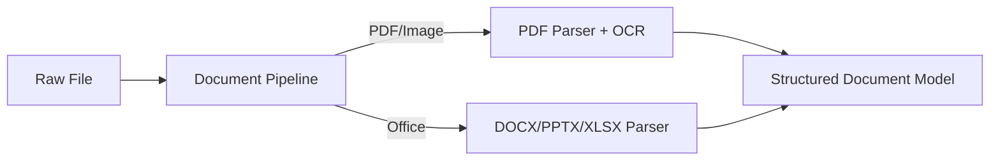

# sayou-document

[](https://pypi.org/project/sayou-document/)
[](https://www.apache.org/licenses/LICENSE-2.0)
[](https://sayouzone.github.io/sayou-fabric/library-guides/document/)

**The Universal Document Parsing Gateway for Sayou Fabric.**

`sayou-document` is a high-fidelity parsing engine that converts diverse document formats (PDF, DOCX, PPTX, XLSX, Images) into a unified, structured **Document Object Model (DOM)**.

Unlike simple text extractors, it preserves the semantic structure of documents—headers, tables, charts, and layout coordinates—making it ideal for RAG (Retrieval-Augmented Generation) and Layout-aware LLM applications.

## 💡 Core Philosophy

**"One Interface, High Fidelity."**

We abstract away the complexity of proprietary file formats. Whether it's a slide deck or a spreadsheet, `sayou-document` normalizes it into a consistent `Document` > `Page` > `Element` hierarchy.

1.  **Smart Routing:** Automatically detects file types (and converts images to PDF if needed) to select the optimal parser.
2.  **Hybrid Extraction:** Combines native text extraction with OCR fallback for scanned pages or images.
3.  **Strict Schema:** Outputs data strictly adhering to Pydantic models, ready for the next pipeline stage (Refinery).



## 📦 Installation

```bash
pip install sayou-document

# For OCR support (requires Tesseract installed on OS)
pip install "sayou-document[ocr]"
```

## ⚡ Quick Start

The `DocumentPipeline` handles file detection, conversion, and parsing automatically.

```python
import os
from sayou.document.pipeline import DocumentPipeline

def run_demo():
    # 1. Initialize Pipeline (with optional OCR)
    pipeline = DocumentPipeline(use_default_ocr=True)
    pipeline.initialize()

    # 2. Parse a file (PDF, Word, Excel, PPT, or Image)
    file_path = "quarterly_report.pdf"
    # file_path = "scan_image.png"  # Images are auto-converted to PDF & OCR'd
    
    with open(file_path, "rb") as f:
        file_bytes = f.read()
        
    doc = pipeline.run(file_bytes, os.path.basename(file_path))
    
    if doc:
        print(f"File: {doc.file_name} ({doc.doc_type})")
        print(f"Pages: {doc.page_count}")
        
        # 3. Access Structured Data
        first_page = doc.pages[0]
        if first_page.elements:
            print(f"Content Preview: {first_page.elements[0].text[:100]}...")
        
        # Export to JSON
        print(doc.model_dump_json(indent=2))

if __name__ == "__main__":
    run_demo()
```

## 🔑 Key Components

### Parsers
* **`PdfParser`**: Extracts text, images, and TOC from PDFs using `PyMuPDF`. Supports full-page OCR for scanned documents.
* **`DocxParser`**: Parses Word documents, preserving heading levels and table structures.
* **`PptxParser`**: Extracts text frames, notes, and tables from slides.
* **`ExcelParser`**: Converts sheets into table elements and extracts embedded images.

### Converters & OCR
* **`ImageToPdfConverter`**: Automatically converts JPG/PNG images to PDF to leverage the robust PDF parsing pipeline.
* **`TesseractOCR`**: (Optional) Provides OCR capabilities for handling scanned content and embedded images.

## 🤝 Contributing

We welcome contributions for new Parsers (e.g., `HwpParser` for Korean documents, `HtmlParser`) or Enhanced OCR integrations (e.g., Google Vision API).

## 📜 License

Apache 2.0 License © 2025 Sayouzone