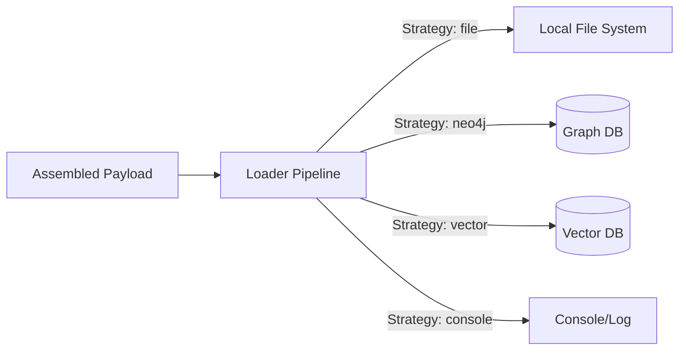

# sayou-loader

[](https://pypi.org/project/sayou-loader/)
[](https://www.apache.org/licenses/LICENSE-2.0)
[](https://sayouzone.github.io/sayou-fabric/library-guides/loader/)

**The Universal Data Transport Engine for Sayou Fabric.**

`sayou-loader` is the final mile delivery system.

It takes the assembled payloads (Graph structures, Vector lists, SQL queries) produced by `sayou-assembler` and reliably transports them to their final destination—whether it's a local file system, a data warehouse, or a vector database.

## 💡 Core Philosophy

**"Safe Delivery, Guaranteed."**

Writing to external systems is the most fragile part of any pipeline due to network issues or database locks. `sayou-loader` ensures stability through:

1.  **Unified Interface:** A single `.write()` method covers Files, SQL, NoSQL, and Vector DBs.
2.  **Resilience:** Built-in `@retry` logic with exponential backoff for network operations.
3.  **Flexibility:** Supports various formats (JSON, JSONL, Pickle) and destinations out-of-the-box.



## 📦 Installation

```bash
pip install sayou-loader
```

## ⚡ Quick Start

The `LoaderPipeline` routes data to the appropriate writer.

```python
from sayou.loader.pipeline import LoaderPipeline

def run_demo():
    # 1. Initialize
    pipeline = LoaderPipeline()
    pipeline.initialize()

    # 2. Prepare Data (Simulated output from Assembler)
    graph_data = {
        "nodes": [{"id": "1", "label": "Topic"}],
        "edges": [{"source": "1", "target": "2", "type": "LINK"}]
    }

    # 3. Load to File (JSON)
    pipeline.run(
        data=graph_data, 
        destination="./output/graph.json", 
        strategy="file"
    )
    
    # 4. Load to Console (Debug)
    pipeline.run(
        data="Deploying to Production DB...", 
        destination="STDOUT", 
        strategy="console"
    )

if __name__ == "__main__":
    run_demo()
```

## 🔑 Key Components

### Templates
* **`FileWriter`**: Saves data to local disk. Supports JSON, JSONL, and Pickle formats automatically based on data type or extension.
* **`JsonLineWriter`**: Efficiently writes large lists of dictionaries line-by-line (NDJSON), ideal for streaming data.
* **`ConsoleWriter`**: Prints data to stdout. Useful for debugging pipelines without side effects.

### Plugins
* **`Neo4jWriter`**: Executes Cypher queries against a Neo4j database.
* **`VectorDbWriter`**: Upserts vector payloads to Pinecone, Chroma, etc.

## 🤝 Contributing

We welcome writers for cloud storages (e.g., `S3Writer`, `GCSWriter`) or specific databases.

## 📜 License

Apache 2.0 License © 2025 Sayouzone