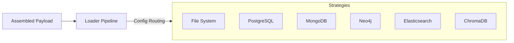

# sayou-loader

[](https://pypi.org/project/sayou-loader/)
[](https://www.apache.org/licenses/LICENSE-2.0)
[](https://sayouzone.github.io/sayou-fabric/library-guides/loader/)

**The Universal Data Transport Engine for Sayou Fabric.**

`sayou-loader` is the final mile delivery system. It abstracts the complexity of writing to external systems, providing a **Unified Interface** to save your Knowledge Graph, Embeddings, or Structured Records.

Whether you are saving to a local file for debugging or pushing millions of vectors to a production database, the interface remains consistent: just call `process()`.

---

## 1. Architecture & Role

The Loader takes the **Assembled Payload** (Nodes, Edges, Documents) and reliably transports it to the target destination based on the selected strategy.



### 1.1. Core Features
* **Unified Write API**: Switch from `JSON` to `PostgreSQL` by changing just one config string.
* **Resilience**: Built-in retry logic with exponential backoff for database connections.
* **Batching**: Automatically handles bulk inserts for high-throughput performance.

---

## 2. Available Strategies

`sayou-loader` supports the following storage backends out-of-the-box.

| Category | Strategy Key | Description |
| :--- | :--- | :--- |
| **File System** | `file` | Saves as JSON, JSONL, or Pickle. Ideal for local debugging. |
| **Graph DB** | `neo4j` | Pushes Nodes and Edges via Cypher queries. |
| **RDB** | `postgres` | Maps structured attributes to Relational Tables. |
| **NoSQL** | `mongo` | Stores raw documents and metadata collections. |
| **Vector DB** | `chroma` | Upserts embeddings for semantic search. |
| **Search Engine** | `elasticsearch` | Indexes text fields for keyword search (BM25). |

---

## 3. Installation

```bash
pip install sayou-loader
```

## 4. Usage

The `LoaderPipeline` is the entry point. You must provide a **Strategy** and the corresponding **Configuration** (credentials).

### Case A: Local File (Simple)

Useful for checking the output of the Assembler during development.

```python
from sayou.loader import LoaderPipeline

payload = {
    "nodes": [{"id": "1", "label": "Topic"}],
    "edges": [{"source": "1", "target": "2", "type": "LINK"}]
}

LoaderPipeline().process(
    data=payload,
    destination="./output/graph.json",
    strategy="file"
)
```

### Case B: Knowledge Graph (Neo4j)

Connects to a Neo4j instance and synchronizes the graph topology.

```python
from sayou.loader import LoaderPipeline

neo4j_config = {
    "uri": "bolt://localhost:7687",
    "user": "neo4j",
    "password": "password",
    "batch_size": 1000
}

LoaderPipeline().process(
    data=payload,
    destination="Neo4j Connection",
    strategy="neo4j",
    config=neo4j_config
)
```

### Case C: Vector Database (Chroma)

Stores text chunks and their vector embeddings.

```python
from sayou.loader import LoaderPipeline

chroma_config = {
    "host": "localhost",
    "port": 8000,
    "collection_name": "sayou_rag"
}

LoaderPipeline().process(
    data=payload,
    destination="ChromaDB",
    strategy="chroma",
    config=chroma_config
)
```

---

## 5. Configuration Keys

When using Database strategies, the `config` dictionary is mandatory.

* **`neo4j`**: `uri`, `user`, `password`, `database` (optional), `batch_size`.
* **`postgres`**: `host`, `port`, `user`, `password`, `dbname`, `table_name`.
* **`mongo`**: `connection_string`, `db_name`, `collection_name`.
* **`elasticsearch`**: `hosts`, `index_name`, `http_auth` (user, pass).
* **`chroma`**: `path` (for local), `host`, `port`, `collection_name`.

---

## 6. License

Apache 2.0 License © 2026 **Sayouzone**