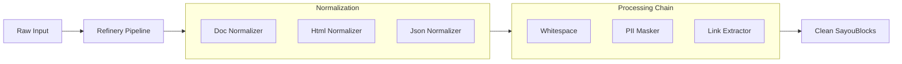

# sayou-refinery

[](https://pypi.org/project/sayou-refinery/)
[](https://www.apache.org/licenses/LICENSE-2.0)
[](https://sayouzone.github.io/sayou-fabric/library-guides/refinery/)

**The Universal Data Cleaning & Normalization Engine for Sayou Fabric.**

`sayou-refinery` acts as the "Cleaning Plant" in your data pipeline. It transforms heterogeneous raw data (JSON Documents, HTML, DB Records) into a standardized stream of **SayouBlocks**.

It ensures that downstream components (like Chunkers or LLMs) receive clean, uniform data regardless of whether the source was a messy web scrape or a structured database row.

---

## 1. Architecture & Role

Refinery operates in two distinct stages to guarantee data quality: **Normalization** (Shape Shifting) and **Processing** (Hygiene).



### 1.1. Core Features
* **Normalization**: Flattens complex structures (Nested JSON, HTML Trees) into a linear list of blocks.
* **Hygiene**: Removes invisible characters, normalizes Unicode, and fixes broken encoding.
* **Safety**: Automatically masks sensitive information (PII) like emails or phone numbers before they reach the LLM.

---

## 2. Available Strategies

`sayou-refinery` provides strategies tailored to specific input formats.

| Strategy Key | Target Format | Description |
| :--- | :--- | :--- |
| **`standard_doc`** | Sayou Document | **[Default]** Converts parsed document dictionaries into Markdown blocks. Applies standard text cleaning. |
| **`html`** | Web Pages | Strips HTML tags, extracts links, and converts the DOM tree into readable text blocks. |
| **`json`** | API/DB Records | Flattens JSON objects into key-value pairs or text representations. |

---

## 3. Installation

```bash
pip install sayou-refinery
```

---

## 4. Usage

The `RefineryPipeline` orchestrates the normalization and processing chain.

### Case A: Document Cleaning (Standard)

Cleans messy OCR output or parsed document text.

```python
from sayou.refinery import RefineryPipeline

raw_doc = {
    "metadata": {"title": "Test Doc"},
    "pages": [{
        "elements": [
            {"type": "text", "text": "Contact:   admin@sayou.ai  "},
            {"type": "text", "text": "Generic    Whitespace   Error"}
        ]
    }]
}

blocks = RefineryPipeline.process(
    data=raw_doc,
    strategy="standard_doc"
)

for block in blocks:
    print(f"[{block.type}] {block.content}")
    # Output: [text] Contact: [EMAIL]
    # Output: [text] Generic Whitespace Error
```

### Case B: HTML Processing

Converts web content into clean text while preserving hyperlinks.

```python
from sayou.refinery import RefineryPipeline

raw_html = """
<html>
    <body>
        <h1>Welcome</h1>
        <p>Click <a href='https://sayou.ai'>here</a>.</p>
    </body>
</html>
"""

blocks = RefineryPipeline.process(
    data=raw_html,
    strategy="html"
)

# Result:
# [heading] Welcome
# [text] Click here (Link: https://sayou.ai)
```

---

## 5. Configuration Keys

Customize the cleaning processors via the `config` dictionary.

* **`mask_pii`**: (bool) Mask emails, phone numbers, and IP addresses.
* **`normalize_whitespace`**: (bool) Collapse multiple spaces and trim lines.
* **`extract_links`**: (bool) Extract `<a>` tags or markdown links into metadata.
* **`remove_stopwords`**: (bool) Filter out common stopwords (optional).

---

## 6. License

Apache 2.0 License © 2026 **Sayouzone**