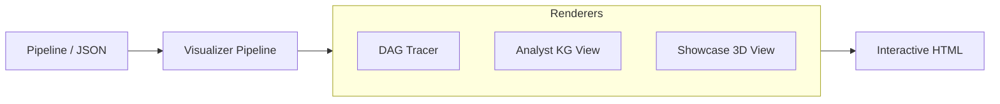

# sayou-visualizer

[](https://pypi.org/project/sayou-visualizer/)
[](https://www.apache.org/licenses/LICENSE-2.0)

**The Interactive Observability Engine for Sayou Fabric.**

`sayou-visualizer` provides transparency to the "Black Box" of data pipelines. It transforms invisible execution logs and complex graph data structures into intuitive, interactive **3D Holographic Knowledge Graphs**.

It serves two distinct purposes: **Pipeline Telemetry** (Debugging flow) and **Knowledge Rendering** (Showcasing data topology).

---

## 1. Architecture & Role

The Visualizer operates as a separate layer that can attach to a running pipeline (Tracer) or read static data (Renderer) to generate HTML artifacts.



### 1.1. Core Features
* **Non-Intrusive Monitoring**: Attaches to any Sayou pipeline via the callback system to visualize execution flow without modifying code.
* **Deterministic Layout**: Uses physics-based rendering (Cytoscape/Force-Graph) to reveal clusters and outliers in your data.
* **Interactive Inspection**: Click on nodes to inspect raw attributes, source code, or relationships in real-time.

---

## 2. Available Strategies

`sayou-visualizer` offers specialized views depending on who is looking at the data.

| Strategy Key | Target Audience | Description |
| :--- | :--- | :--- |
| **`tracer`** | Data Engineer | Visualizes the **Pipeline Execution Flow** (DAG). Shows which components triggered which tasks. |
| **`analyst`** | QA / Researcher | **2D Analytic View**. Focuses on strict schema validation, attribute inspection, and debugging specific relationships. |
| **`showcase`** | Stakeholder | **3D Holographic View**. A visually stunning, high-performance renderer for presenting the scale and topology of the Knowledge Graph. |

---

## 3. Installation

```bash
pip install sayou-visualizer
```

---

## 4. Usage

The `VisualizerPipeline` is the entry point. You can use it to render existing graph files or attach it to live pipelines.

### Case A: Rendering a Knowledge Graph (3D Showcase)

Visualizes the output of `sayou-assembler` as an interactive 3D galaxy.

```python
from sayou.visualizer import VisualizerPipeline

viz = VisualizerPipeline()

kg_file_path = "./output/graph_data.json"

viz.process(
    source=kg_file_path,
    destination="./output/report_showcase.html",
    strategy="showcase"
)

print("Report generated. Open 'report_showcase.html' in your browser.")
```

### Case B: Debugging Graph Data (2D Analyst)

Generates a detailed 2D view for inspecting node attributes and edge types.

```python
viz.process(
    source=kg_file_path,
    destination="./output/report_analyst.html",
    strategy="analyst"
)
```

### Case C: Pipeline Tracing (Live Monitoring)

Attaches to a running Connector pipeline to visualize the crawling process.

```python
from sayou.connector import ConnectorPipeline
from sayou.visualizer import VisualizerPipeline

connector = ConnectorPipeline()

viz = VisualizerPipeline()
viz.attach_to(connector)

connector.process(source="https://news.daum.net/tech", strategy="web")

viz.report("pipeline_trace.html")
```

---

## 5. Configuration Keys

Customize the visual appearance via the `config` dictionary.

* **`showcase`**: `node_color_by` (e.g., class), `particle_speed`, `background_color`.
* **`analyst`**: `layout_algorithm` (dagre/concentric), `show_attributes` (bool).
* **`tracer`**: `include_data_payload` (bool), `max_events`.

---

## 6. License

Apache 2.0 License © 2026 **Sayouzone**