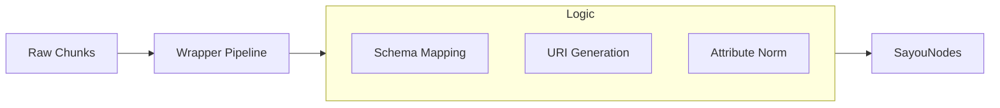

# sayou-wrapper

[](https://pypi.org/project/sayou-wrapper/)
[](https://www.apache.org/licenses/LICENSE-2.0)
[](https://sayouzone.github.io/sayou-fabric/library-guides/wrapper/)

**The Ontology Mapper for Sayou Fabric.**

`sayou-wrapper` takes the fragmented chunks produced by `sayou-chunking` and wraps them into a standardized graph structure (**SayouNode**). This is the final preparation step before data is assembled into a Knowledge Graph or loaded into a Vector DB.

It applies the **Sayou Ontology Schema** (Namespace -> Class -> Predicate) to raw data, turning simple text into semantically rich entities.

---

## 1. Architecture & Role

The Wrapper sits between Chunking and Assembly. It transforms raw dictionaries (Chunks) into standardized Objects (Nodes) with globally unique URIs.



### 1.1. Core Features
* **Ontology Enforcement**: Assigns strict classes (e.g., `sayou:Topic`, `sayou:Function`) based on chunk metadata.
* **URI Normalization**: Generates idempotent IDs (e.g., `sayou:doc:hash_123`) to prevent duplication.
* **Metadata Preservation**: Carries over source coordinates (page numbers, line numbers) into node attributes.

---

## 2. Available Strategies

`sayou-wrapper` applies different mapping rules based on the source domain.

| Strategy Key | Target Domain | Description |
| :--- | :--- | :--- |
| **`document_chunk`** | PDF, Markdown | Maps headers to `sayou:Topic` and text to `sayou:TextFragment`. Preserves hierarchy metadata. |
| **`code_chunk`** | Python, Java | Maps AST objects to `sayou:Class`, `sayou:Function`, or `sayou:Module`. |
| **`video_chunk`** | YouTube, MP4 | Maps timestamps to `sayou:VideoSegment`. Preserves start/end times. |
| **`general`** | Plain Text | **[Default]** Treats everything as generic `sayou:Unstructured` nodes. |

---

## 3. Installation

```bash
pip install sayou-wrapper
```

---

## 4. Usage

The `WrapperPipeline` converts a list of dictionaries (Chunks) into a `WrapperOutput` object containing nodes.

### Case A: Document Processing (Default)

Converts hierarchical chunks into Topic and Fragment nodes.

```python
from sayou.wrapper import WrapperPipeline

chunks = [
    {
        "content": "# Introduction",
        "metadata": {
            "chunk_id": "h_1", 
            "semantic_type": "heading", 
            "depth": 1
        }
    },
    {
        "content": "Sayou is great.",
        "metadata": {
            "chunk_id": "p_1", 
            "parent_id": "h_1",
            "semantic_type": "text"
        }
    }
]

result = WrapperPipeline.process(
    data=chunks,
    strategy="document_chunk"
)

for node in result.nodes:
    print(f"[{node.node_class}] {node.node_id}")
```

### Case B: Code Processing

Converts AST-based chunks into structural code nodes.

```python
from sayou.wrapper import WrapperPipeline

code_chunks = [
    {
        "content": "def my_func(): pass",
        "metadata": {"type": "function", "name": "my_func"}
    }
]

result = WrapperPipeline.process(
    data=code_chunks,
    strategy="code_chunk"
)

print(f"Node Class: {result.nodes[0].node_class}")
```

---

## 5. Configuration Keys

The `config` dictionary controls how IDs are generated and which schema strictness to apply.

* **`namespace`**: The prefix for URIs (default: `sayou:`).
* **`id_strategy`**: `hash` (deterministic) or `uuid` (random).
* **`strict_mode`**: If `True`, raises error for unknown semantic types.
* **`attribute_filter`**: List of metadata keys to exclude from the final Node attributes.

---

## 6. License

Apache 2.0 License © 2026 **Sayouzone**